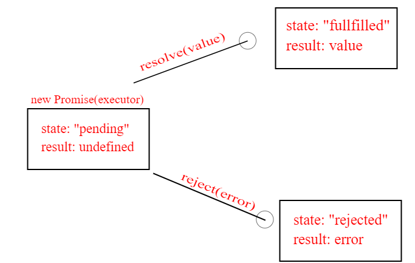

# Note:- This is doubt session

<ul>
  <li>
    Yestarday's class Topics
    <ul>
      <li>[✅] Callbacks</li>
      <li>[✅] Promises</li>
      <li>[✅] then()</li>
      <li>[✅] fetch</li>
      <li>[✅] Async & await</li>
      <li>[✅] local Storage</li>
      <li>[✅] session storage</li>
      <li>[✅] cache</li>
    </ul>
  </li>
   
  <li>
    App steps
    <ul>
      <li>[✅] html & css (already written)</li>
      <li>[✅] select all DOM nodes</li>
      <li>[✅] create a Function to fetch dog breeds which returns the json data</li>
      <li>[✅] Store this fetched data in function</li>
      <li>[✅] Make new function (getResponse) to dynamically add images...</li>
      <li>[✅] add Eventlistener to dogBtn to search breed</li>
      <li>[✅] add inut.value as query in api</li>
    </ul>
  </li>
   
</ul>

- APi `https://dog.ceo/api/breed/hound/images/random/10`

Callbacks

 

     pass functions as parameters to other functions and call them inside the outer functions.
      
     <code> function sayHello(callBack){ 
                  callBack() 
     }
     </code>
      
     

        The print( ) function takes another function as a parameter and calls it inside. This is valid in JavaScript and we call it a “callback”. So a function that is passed to another function as a parameter is a callback function. But that’s not all.
     

     

     Callbacks make sure that a <strong>function is not going to run before a task is completed but will run right after the task has completed.</strong> It helps us develop asynchronous JavaScript code and keeps us safe from problems and errors.
     

     

 

 

	
Promises

 
A promise in JavaScript is similar to a promise in real life. When we make a promise in real life, it is a guarantee that we are going to do something in the future. Because promises can only be made for the future.

    The executor receives two arguments: <code>resolve and reject</code>. These functions are pre-defined by the JavaScript engine, so we don’t need to create them. We should only call one of them when ready.
     
    After one second of “processing” the executor calls resolve("done") to produce the result. This changes the state of the promise object:

<ul>
<strong>The Promise API proposes the following:</strong>
 
<li> Each asynchronous task will return a promise object.</li>
 

<li> Each promise object will have a then function that can take two arguments, a success handler and an error handler.</li>
 

<li> The success or the error handler in the then function will be called only once, after the asynchronous task finishes.</li>
 

<li> The then function will also return a promise, to allow chaining multiple calls.</li>
 

<li> Each handler (success or error) can return a value, which will be passed to the next function as an argument, in the chain of promises.</li>
 

<li> If a handler returns a promise (makes another asynchronous request), then the next handler (success or error) will be called only after that request is finished.</li>
 </ul>

<code> .then() </code>

 
    A promise is a pattern for handling asynchronous operations. The promise allows you to call a method called "then" that lets you specify the function(s) to use as the callbacks.

 

  
localStorage & session storage

  

    <strong>What is session storage?</strong> As soon as user visites the webapp
    the session is started; as user closes the window session will be finished.
  

  

    ❇ So in session storage, the data is stored in the browser’s memory for that
    specific session. Session more here means until you close the browser
    window. Unlike cookies, the data in sessionStorage is never transferred to
    the server while making a network request.
  

  

    ❇ The storage limit of session storage is also very high when compared to
    cookies. The cookies which can generally store around 4000 bytes of data
    here session storage can store at least 5 MB of data or even more than that
    depending on the device and browser. Which is a lot!
  

  

    ❇<strong>  If we talk about localStorage</strong>, it is almost the same as the session
    storage but the major difference is that it does not have an expiry. So Even
    if you close the browser and restart your system and come back again anytime
    the data persists. That makes it unique and very useful. And among these 3,
    localStorage has higher memory limit.
  

  

    ❇ One more important thing to note here is that due to security reasons it
    follows the same-origin policy. Same-Origin refers to the same Protocol,
    same host, and the same port.
  

 

