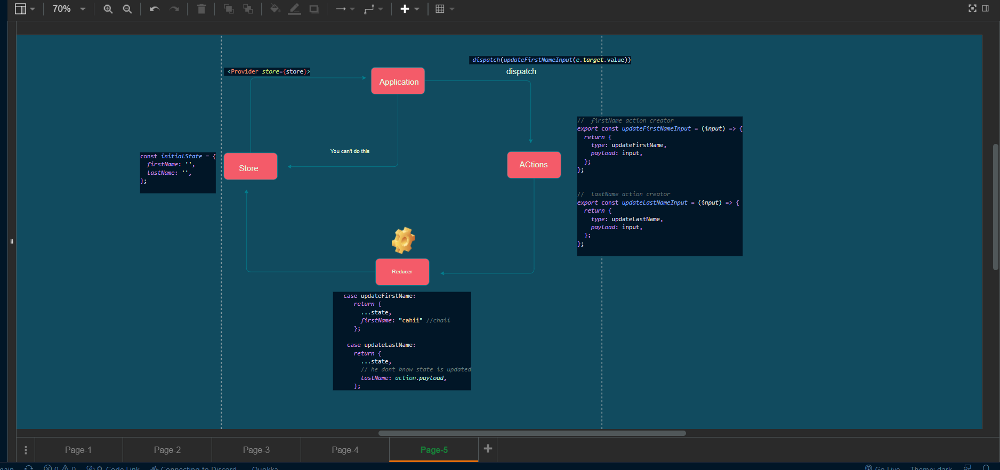

# Day 26

## THA

React : - 6
Redux : - `more than 6 files`

- https://cs536.csb.app/

<br />
<br />

# Basics

- `useReducer` Hook ?

- Examples https://stackblitz.com/edit/usereducer-examples-must

<br />
<br />

# Explain Redux Working

- install redux react-redux `npm i redux react-redux`
- create folder structure

<br />
<br />

# Plan

> store

```jsx
import { createStore } from 'redux';

// it takes reducer function as an parameter
const store = createStore();
```

<br />

> create state

# State

```jsx
let initialState = {
  firstName: '',
  lastName: '',
};
```

<br />

> action types

```js
updateFirstName = 'updateFirstName';
updateLastName = 'updateFirstName';
```

<br />

> action creators

```js
// firstName updater
const updateFirstNameInput = (input) => {
  return {
    type: updateFistName,
    payload: input,
  };
};

// lastName updater
const updateLastName = (input) => {
  return {
    type: updateLastName,
    payload: input,
  };
};
```

> <br />

> reducer

```js
case updateFirstName:
    firstName: "Do something"

case updateLastName:
    lastName: "do Somethignwith last name "

```

> <br />

> import reducer in store...
> <br />

> we need to provide redux store to its child

<br />
<br />

<hr>


